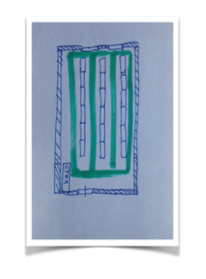

# О задаче
У компании имеется следующий склад (см. рис), три ряда стеллажей, стоящие в ряд по
700 ед. Каждый стеллаж содержит 5 полок. Каждая полка содержит 6 ячеек. Между рядами
стеллажей есть проходы. Между стеллажами в одном ряду проходов нет. Ширина полок
одинакова и равна ширине прохода. Зеленым цветом обозначены проходы.
Кладовщику выдается случайный перечень ячеек, из которых требуется взять товар.
Помогите составить маршрут передвижения кладовщика по складу, начиная движение от
стола, таким образом, чтобы он затратил минимально возможный путь.
1. Достаточно описать шаги алгоритма решения задачи.
2. Объясните почему решение оптимальное.

# Решение
1. Использовать Алгоритм Дейкстры. В расстояние (ребро) помимо пути до стеллажа добавляется позиция ячейки на полке,
полки на стеллаже. В вершины, помимо ячеек добавляется фиксированная стартовая вершина (стол) и конечная точка (опять стол)
2. Алгоритм оптимален, потому что по задаче коммиявояжера находится оптимальный путь между вершинами